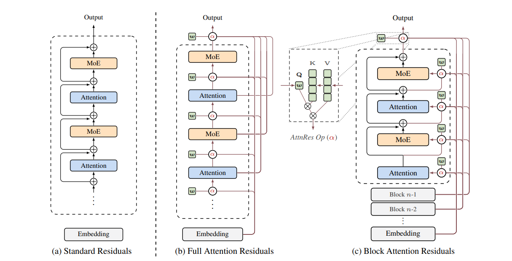

# Attention Residuals (AttnRes)

[https://github.com/MoonshotAI/Attention-Residuals](https://github.com/MoonshotAI/Attention-Residuals)

> Residual connections with PreNorm are standard in modern LLMs, yet they accumulate all layer outputs with **fixed unit weights**. This causes uncontrolled hidden-state growth with depth, progressively diluting each layer's contribution. **Attention Residuals** replaces this fixed accumulation with softmax attention over preceding layer outputs, allowing each layer to **selectively aggregate** earlier representations with learned, input-dependent weights.

---

## Architecture Overview



| Variant | Description | Memory |
|---|---|---|
| **(a) Standard Residuals** | Uniform additive accumulation | $O(d)$ |
| **(b) Full AttnRes** | Each layer attends over all previous layer outputs | $O(Ld)$ |
| **(c) Block AttnRes** | Layers grouped into blocks; attend over block-level reps | $O(Nd)$ |

---

## Background: Standard Residuals

Each layer updates the hidden state as:

$$\mathbf{h}_l = \mathbf{h}_{l-1} + f_{l-1}(\mathbf{h}_{l-1}) = \mathbf{h}_1 + \sum_{i=1}^{l-1} f_i(\mathbf{h}_i)$$

Every layer's contribution is weighted **uniformly** (coefficient = 1). This gives no mechanism to adapt the mixing across depth, causes hidden-state growth, and forces deeper layers to learn increasingly large outputs to gain influence.

---

## 1. Full Attention Residuals

The key idea: treat depth like sequence length and replace fixed accumulation with **softmax attention over depth**.

### Formula

$$\mathbf{h}_l = \sum_{i=0}^{l-1} \alpha_{i \to l} \cdot \mathbf{v}_i$$

Attention weights are computed as:

$$
\alpha_{i \to l} = \frac{\phi(\mathbf{q}_l,\, \mathbf{k}_i)}{\displaystyle\sum_{j=0}^{l-1} \phi(\mathbf{q}_l,\, \mathbf{k}_j)}, \qquad \phi(\mathbf{q}, \mathbf{k}) = \exp\bigl(\mathbf{q}^\top \mathrm{RMSNorm}(\mathbf{k})\bigr)
$$

Queries and keys are defined as:

$$
\mathbf{q}_l = \mathbf{w}_l \in \mathbb{R}^d \quad \text{(learnable per-layer vector)}, \qquad
\mathbf{k}_i =
\left\{
\begin{aligned}
\mathbf{h}_1 &\quad i = 0 \\
f_i(\mathbf{h}_i) &\quad 1 \le i \le l-1
\end{aligned}
\right.
$$

The RMSNorm inside $\phi$ prevents layers with large-magnitude outputs from dominating. **Complexity:** $O(L^2 d)$ arithmetic, $O(Ld)$ memory.

### Implementation

```python
@staticmethod
def _depth_attention(query: Tensor, values: list[Tensor], key_norm: RMSNorm) -> Tensor:
    V = torch.stack(values, dim=0)          # [N, B, T, D]
    K = key_norm(V)                          # [N, B, T, D]  — RMSNorm on keys
    logits = torch.einsum("d, n b t d -> n b t", query, K)  # q^T · RMSNorm(k_i)
    weights = logits.softmax(dim=0)                          # softmax over depth
    h = torch.einsum("n b t, n b t d -> b t d", weights, V) # weighted sum
    return h
```

Each layer call:

```python
def forward(self, layer_outputs: list[Tensor]) -> list[Tensor]:
    # attention sub-layer
    h = self._depth_attention(self.attn_query, layer_outputs, self.attn_key_norm)
    attn_out = self.attn(self.attn_norm(h))
    layer_outputs.append(attn_out)

    # MLP sub-layer
    h = self._depth_attention(self.mlp_query, layer_outputs, self.mlp_key_norm)
    mlp_out = self.mlp(self.mlp_norm(h))
    layer_outputs.append(mlp_out)

    return layer_outputs
```

> **Note:** `layer_outputs` stores individual **deltas** $f_i(\mathbf{h}_i)$, not accumulated states. The full representation at any point is always computed on-the-fly by `_depth_attention`. A final aggregation pass is applied before the LM head.

---

## 2. Block Attention Residuals

Full AttnRes requires storing all $L$ layer outputs ($O(Ld)$ memory). Block AttnRes reduces this by grouping layers into $N$ blocks and attending over **block-level representations**.

### Intra-Block Accumulation

Layers within a block are summed via standard residuals:

$$\mathbf{b}_n = \sum_{j \in \mathcal{B}_n} f_j(\mathbf{h}_j)$$

$\mathbf{b}_n^i$ denotes the partial sum over the first $i$ layers in block $n$. The token embedding is always exposed as $\mathbf{b}_0 = \mathbf{h}_1$.

### Inter-Block Attention

For the $i$-th layer in block $n$, the value set is:

$$\mathbf{V} = \begin{cases} [\mathbf{b}_0,\, \mathbf{b}_1,\, \ldots,\, \mathbf{b}_{n-1}]^\top & i = 1 \;\text{(first layer of block)} \\ [\mathbf{b}_0,\, \mathbf{b}_1,\, \ldots,\, \mathbf{b}_{n-1},\, \mathbf{b}_n^{i-1}]^\top & i \ge 2 \;\text{(subsequent layers)} \end{cases}$$

**Efficiency:** $N = L$ recovers Full AttnRes; $N = 1$ reduces to standard residuals. Empirically $N \approx 8$ recovers most of the benefit.

### Implementation

```python
def block_attn_res(
    blocks: list[Tensor], partial_block: Tensor, query: Tensor, norm: RMSNorm
) -> Tensor:
    V = torch.stack(blocks + [partial_block], dim=0)   # [N+1, B, T, D]
    K = norm(V)
    logits = torch.einsum("d, n b t d -> n b t", query, K)
    weights = logits.softmax(dim=0)
    return torch.einsum("n b t, n b t d -> b t d", weights, V)
```

Single-layer forward pass:

```python
def forward(self, blocks: list[Tensor], partial_block: Tensor):
    # inter-block attention before self-attention
    h = block_attn_res(blocks, partial_block, self.attn_res_query, self.attn_res_norm)

    # push completed block at block boundary
    if self.layer_idx % layers_per_block == 0 and self.layer_idx > 0:
        blocks = blocks + [partial_block]
        partial_block = torch.zeros_like(partial_block)

    # self-attention sub-layer
    attn_out = self.attn(self.attn_norm(h))
    partial_block = partial_block + attn_out

    # inter-block attention before MLP
    h = block_attn_res(blocks, partial_block, self.mlp_res_query, self.mlp_res_norm)

    # MLP sub-layer
    mlp_out = self.mlp(self.mlp_norm(h))
    partial_block = partial_block + mlp_out

    return blocks, partial_block
```

---

## Complexity Comparison

| | Memory | Compute |
|---|---|---|
| Standard Residuals | $O(d)$ | $O(L)$ |
| Full AttnRes | $O(Ld)$ | $O(L^2 d)$ |
| Block AttnRes ($N$ blocks) | $O(Nd)$ | $O(N^2 d)$ |

Since $L \ll T$ (depth is far smaller than sequence length), the extra cost of Full AttnRes is modest. Block AttnRes with $N \approx 8$ recovers most of the gains at a fraction of the cost.

